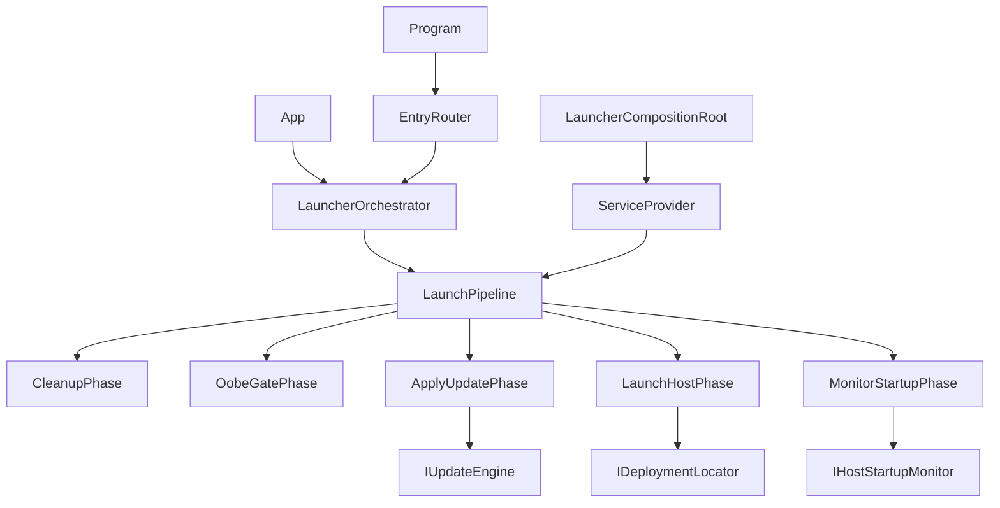
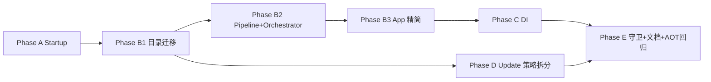

# Launcher 单项目内部解耦改造计划（执行版）

## 0. 硬性约束


| 约束           | 说明                                                                                                                                                        |
| ------------ | --------------------------------------------------------------------------------------------------------------------------------------------------------- |
| **单项目**      | 仅 `[LanMountainDesktop.Launcher/LanMountainDesktop.Launcher.csproj](LanMountainDesktop.Launcher/LanMountainDesktop.Launcher.csproj)`，不新建 Launcher.* 独立程序集 |
| **单 exe**    | 仍只发布 `LanMountainDesktop.Launcher.exe`（AOT 单文件）                                                                                                           |
| **零部署风险**    | 不改变安装包目录结构、不引入新进程、不改变 Public IPC / Coordinator IPC 拓扑与契约                                                                                                  |
| **增量重构**     | 一个职责域一域推进，每步 `dotnet build` + 相关 `dotnet test` 通过后再进下一步                                                                                                   |
| **单进程性能**    | 模块间仅 in-process 接口调用，不为解耦新增 IPC                                                                                                                           |
| **未来可拆**     | 各域暴露 `I`* 接口，将来若需多进程可直接复用契约                                                                                                                               |
| **Git 自主提交** | Agent 在每个职责域完成且验证通过后 **自动 commit**，无需用户手动提交（见 §8）                                                                                                         |


外部共享库 `[LanMountainDesktop.PluginPackaging](LanMountainDesktop.PluginPackaging/)` 保留（Host + Launcher CLI 共用），不属于 Launcher 拆分。

---

## 1. 验收标准（必须全部满足）

### 1.1 零部署风险

- Inno Setup / CI 产物仍只有：`LanMountainDesktop.Launcher.exe` + `app-{version}/` + `.launcher/`
- Host 调用 Launcher 的 CLI 参数、`launch-source`、`apply-update` 路径不变
- Public IPC routes（`lanmountain.launcher.startup-progress`、`loading-state`）与 Coordinator pipe 不变
- VeloPack / 更新 apply 状态机（`.current/.partial/.destroy`）行为不变

### 1.2 增量可验证

- 每个 Phase 结束：编译绿 + 该域新增/既有测试绿
- 允许「纯移动文件」的 PR 单独提交，行为 diff 为零

### 1.3 测试友好

- `Startup/`、`Update/`、`Deployment/` 内类型 **无 Avalonia 依赖**，可独立单元测试
- 每个 `ILaunchPhase`、每个 Update 策略类各有对应测试类
- 保留并扩展现有 `[LauncherStartupTimeoutPolicyTests](LanMountainDesktop.Tests/LauncherStartupTimeoutPolicyTests.cs)`、`[LauncherMultiInstancePolicyTests](LanMountainDesktop.Tests/LauncherMultiInstancePolicyTests.cs)`

### 1.4 启动性能

- Pipeline 阶段为同步/异步方法调用链，不引入额外进程或网络
- DI 容器仅在进程入口构建一次；Stage/Phase 实例可复用 Singleton

### 1.5 代码结构目标


| 对象                                  | 当前（实测）                                       | 目标                                                  |
| ----------------------------------- | -------------------------------------------- | --------------------------------------------------- |
| `LauncherFlowCoordinator` 全 partial | ~1880 行（859+568+279+…）                       | **删除**；逻辑迁入 Pipeline + Phases                       |
| `RunAsync()` 等价逻辑                   | 跨 partial ~800+ 行 while/阶段混杂                 | **≤80 行** 编排入口，细节在各 Phase                           |
| `UpdateEngineService`               | ~1622 行                                      | 门面 **≤200 行** + 6 个策略类各 **≤300 行**                  |
| `App.axaml.cs`                      | ~258 行（已部分瘦身）                                | **≤120 行**：纯 Avalonia + 一行委托 `LauncherOrchestrator` |
| `LauncherOrchestrator`              | 不存在（逻辑在 Coordinator + CompositionRoot 546 行） | **≤250 行**：GUI 入口编排                                 |
| `LauncherCompositionRoot`           | ~546 行                                       | **≤150 行**：仅 DI 构建 + 入口分发                           |


---

## 2. 目标架构

### 2.1 核心类型关系




**命名约定：**

- `**LauncherOrchestrator`**：GUI 生命周期内的唯一编排入口（取代 `LauncherFlowCoordinator` 对外角色）
- `**LaunchPipeline**`：按序执行 `ILaunchPhase` 列表
- `**ILaunchPhase**`：原 `ILaunchPipelineStage`；每个 Phase 对应原 `RunAsync` 中一个职责段

### 2.2 职责域目录（单项目内）

```
LanMountainDesktop.Launcher/
├── Program.cs                         # CLI / GUI 路由
├── App.axaml.cs                       # 纯 Avalonia（≤120 行）
├── Shell/
│   ├── LauncherOrchestrator.cs        # GUI 编排入口
│   ├── LauncherCompositionRoot.cs     # DI + Entry 分发
│   ├── LaunchPipeline.cs
│   ├── Phases/                        # ILaunchPhase 实现
│   │   ├── CleanupDeploymentsPhase.cs
│   │   ├── OobeGatePhase.cs
│   │   ├── ApplyPendingUpdatePhase.cs
│   │   ├── LaunchHostPhase.cs
│   │   └── MonitorStartupPhase.cs
│   └── EntryHandlers/                 # apply-update / air-app-broker / attach
├── Deployment/
├── Update/
│   ├── IUpdateEngine.cs
│   ├── UpdateEngineFacade.cs          # 原 UpdateEngineService 门面
│   └── Strategies/
│       ├── PendingUpdateDetector.cs
│       ├── UpdatePackageVerifier.cs
│       ├── DeploymentActivator.cs
│       ├── UpdateSnapshotStore.cs
│       ├── RollbackStrategy.cs
│       └── IncomingArtifactsCleaner.cs
├── Startup/
├── Oobe/
├── Ipc/
├── AirApp/
├── Plugins/
├── Infrastructure/
├── Models/
└── Views/
```

### 2.3 模块依赖规则

- `Deployment/`、`Update/`、`Startup/`：**禁止** `using Avalonia`
- `Views/`：**禁止** 引用具体 `UpdateEngineFacade` / `DeploymentLocator`（仅接口或 Orchestrator）
- 跨域：**仅通过 `I`* 接口**；Orchestrator/Pipeline 负责装配

### 2.4 与 Host 边界（不变）


| 能力                         | Owner                          |
| -------------------------- | ------------------------------ |
| OOBE / Splash / 多实例 / 启动检测 | Launcher `Startup/` + `Shell/` |
| 更新 apply / rollback        | Launcher `Update/`             |
| 插件市场 / pending             | Host + PluginPackaging         |
| 更新 download                | Host → spawn Launcher apply    |


---

## 3. 三大核心拆分（用户指定）

### 3.1 拆分 `LauncherFlowCoordinator`：`RunAsync` → Pipeline + Phase

**现状：** 逻辑分散在 4 个 partial，等效一个 1800+ 行 God Class；`RunAsync` 内含清理、OOBE、更新、启动、IPC 监听、超时 while-loop、多实例分支。

**目标 API（单项目 `Shell/` 内）：**

```csharp
internal interface ILaunchPhase
{
    string PhaseId { get; }
    /// <returns>null = 继续下一阶段；非 null = 管道终止并返回结果</returns>
    Task<LauncherResult?> ExecuteAsync(LaunchContext context, CancellationToken cancellationToken);
}

internal sealed class LaunchPipeline
{
    public LaunchPipeline(IEnumerable<ILaunchPhase> phases) { ... }
    public Task<LauncherResult> RunAsync(LaunchContext context, CancellationToken ct);
}
```

**Phase 映射（与原 RunAsync 步骤一一对应）：**


| Phase                     | 原 RunAsync 段                            | 产出                            |
| ------------------------- | --------------------------------------- | ----------------------------- |
| `CleanupDeploymentsPhase` | `CleanupOldDeployments`                 | 无 UI                          |
| `ExistingHostProbePhase`  | 多实例 / Public IPC 探测                     | 可短路成功                         |
| `ApplyPendingUpdatePhase` | `_updateEngine.ApplyPendingUpdateAsync` | 失败仍继续                         |
| `OobeGatePhase`           | migration + OOBE steps                  | UI via `ILauncherUiPresenter` |
| `LaunchHostPhase`         | `LaunchHostWithIpcAsync`                | Process + plan                |
| `MonitorStartupPhase`     | while-loop + IPC + timeout              | 调用 `IHostStartupMonitor`      |


`**LauncherOrchestrator` 职责：**

- 接收 `SplashWindow`、构建 `LaunchContext`（含 reporter、attempt registry、coordinator server）
- 调用 `LaunchPipeline.RunAsync`
- 管理 Splash/Error 窗口生命周期（委托 `ILauncherUiPresenter`）
- **不含** 更新/部署/IPC 细节

**删除清单：** `LauncherFlowCoordinator.cs` 及全部 partial 文件。

---

### 3.2 拆分 `UpdateEngineService` → 门面 + 策略类

**现状：** ~1622 行单文件，混合检测、验签、解压、激活、快照、回滚、清理。

**目标结构：**

```
Update/
├── IUpdateEngine.cs                    # 对外契约（未来多进程可原样抽出）
├── UpdateEngineFacade.cs               # 门面，编排策略，≤200 行
└── Strategies/
    ├── IUpdateStrategy.cs              # 可选：各策略统一接口
    ├── PendingUpdateDetector.cs        # CheckPendingUpdate
    ├── UpdatePackageVerifier.cs        # manifest + RSA 签名
    ├── UpdatePackageExtractor.cs       # 解压 / 增量复用
    ├── DeploymentActivator.cs          # .current / .partial / .destroy
    ├── UpdateSnapshotStore.cs          # snapshots 读写
    ├── RollbackStrategy.cs             # rollback CLI/GUI
    └── IncomingArtifactsCleaner.cs     # CleanupIncomingArtifacts
```

**门面方法映射：**


| 原 `UpdateEngineService` 公开方法 | 委托策略                                                   |
| ---------------------------- | ------------------------------------------------------ |
| `CheckPendingUpdate()`       | `PendingUpdateDetector`                                |
| `ApplyPendingUpdateAsync()`  | Detector → Verifier → Extractor → Activator → Snapshot |
| `RollbackLatest()`           | `RollbackStrategy`                                     |
| `CleanupIncomingArtifacts()` | `IncomingArtifactsCleaner`                             |
| `DownloadAsync()`（若有）        | 保持或拆 `UpdateDownloader`                                |


**测试：** 每个 Strategy 独立 mock `IDeploymentLocator` / 文件系统，不启 Avalonia。

---

### 3.3 精简 `App.axaml.cs` → 纯 Avalonia + `LauncherOrchestrator`

**现状：** ~258 行，仍含 apply-update、air-app-broker、preview、coordinator attach 等分支。

**目标结构：**

```csharp
// App.axaml.cs 目标形态（概念）
public override void OnFrameworkInitializationCompleted()
{
    if (ApplicationLifetime is IClassicDesktopStyleApplicationLifetime desktop)
    {
        var context = LauncherRuntimeContext.Current;
        var mode = LauncherEntryModeResolver.Resolve(context);
        _ = LauncherOrchestrator.RunAsync(desktop, context, mode);
    }
    base.OnFrameworkInitializationCompleted();
}
```

**从 App 迁出的逻辑 → `Shell/EntryHandlers/`：**


| 现 App 分支          | 新 Handler                              |
| ----------------- | -------------------------------------- |
| `launch` + splash | `GuiLaunchEntryHandler` → Orchestrator |
| `apply-update`    | `ApplyUpdateEntryHandler`              |
| `air-app-broker`  | `AirAppBrokerEntryHandler`             |
| debug preview     | `PreviewEntryHandler`                  |


**验收：** `App.axaml.cs` ≤120 行；不含 `new UpdateEngineService` / `new DeploymentLocator` / while-loop。

---

## 4. 分阶段执行顺序与 Git 提交点




### Phase A：Startup 子系统 + AOT 生产 bug（优先）

- 抽出 `Startup/HostStartupMonitor.cs`（从 partial 独立）
- 修复 IPC 连接退避、成功判定统一走 `StartupSuccessTracker`
- Host 侧 `DesktopVisible` 上报对齐（仅日志/时序，不改 IPC 契约）
- 测试 + `**git commit**`: `fix(launcher): extract HostStartupMonitor and harden startup detection`

### Phase B1：目录迁移（零逻辑变更）

- 物理移动文件到 `Deployment/`、`Update/`、`Startup/` 等，更新 namespace
- `dotnet build` + test
- `**git commit**`: `refactor(launcher): reorganize into responsibility folders`

### Phase B2：Pipeline + Phase + LauncherOrchestrator

- 实现 `ILaunchPhase`、`LaunchPipeline`、`LauncherOrchestrator`
- 逐 Phase 从 Coordinator 迁移逻辑（可先并行运行对照测试）
- 删除 `LauncherFlowCoordinator*`
- `**git commit**`: `refactor(launcher): replace LauncherFlowCoordinator with LaunchPipeline`

### Phase B3：App.axaml.cs 精简

- EntryHandlers 提取；App 仅 Avalonia + Orchestrator 委托
- `**git commit**`: `refactor(launcher): slim App.axaml.cs to Avalonia shell only`

### Phase C：轻量 DI

- `LauncherServiceRegistration.cs` + `Microsoft.Extensions.DependencyInjection`
- Program / CliHost / CompositionRoot 统一 `ServiceProvider`
- `**git commit**`: `refactor(launcher): add composition-root DI wiring`

### Phase D：UpdateEngine 策略拆分（可与 B2 并行，依赖 B1）

- 策略类提取 + `UpdateEngineFacade`
- 删除原巨型 `UpdateEngineService.cs`
- 每策略测试
- `**git commit**`: `refactor(launcher): split UpdateEngine into strategy classes`

### Phase E：守卫 + 文档 + AOT 回归

- `LauncherArchitectureTests`（命名空间依赖规则）
- 更新 `[docs/LAUNCHER.md](docs/LAUNCHER.md)`、`[.trae/specs/launcher-shell-hardening/spec.md](.trae/specs/launcher-shell-hardening/spec.md)`
- AOT publish 本地 smoke：launch / apply-update / 多实例 / 启动检测
- `**git commit**`: `docs(launcher): document module boundaries and add architecture tests`

---

## 5. Phase / Service 测试矩阵


| 组件                      | 测试文件                         | 覆盖点                               |
| ----------------------- | ---------------------------- | --------------------------------- |
| `StartupSuccessTracker` | `StartupSuccessTrackerTests` | Foreground/Tray/Background policy |
| `HostStartupMonitor`    | `HostStartupMonitorTests`    | 超时、IPC 延迟、ShellStatus 轮询          |
| `LaunchPipeline`        | `LaunchPipelineTests`        | Phase 短路、失败传播                     |
| 各 `ILaunchPhase`        | `*PhaseTests`                | 单阶段 mock                          |
| `PendingUpdateDetector` | `PendingUpdateDetectorTests` | 无 pending / corrupt               |
| `DeploymentActivator`   | `DeploymentActivatorTests`   | 标记文件状态机                           |
| `RollbackStrategy`      | `RollbackStrategyTests`      | 快照回退                              |
| 命名空间规则                  | `LauncherArchitectureTests`  | 无 Avalonia 泄漏                     |


---

## 6. 明确不做

- 不新建 csproj（Launcher.Deployment 等）
- 不新建 exe / Windows Service
- 不改变 Public IPC / Coordinator IPC 协议
- 不把插件市场安装迁回 Launcher
- 不为模块间通信引入新 IPC（仅保留现有 Host↔Launcher 契约）

---

## 7. 风险与缓解


| 风险              | 缓解                                                                 |
| --------------- | ------------------------------------------------------------------ |
| 大规模移动 merge 冲突  | B1 独立 commit，零逻辑变更                                                 |
| Pipeline 迁移行为回归 | 先写 Phase 级测试再迁代码；保留 `LMD_LAUNCHER_LEGACY_COORDINATOR=1` 开关一个版本（可选） |
| AOT + DI        | 显式注册，禁止反射扫描；`PublishAot` CI 步骤验证                                   |
| Update 拆分遗漏路径   | CLI `update *` 与 GUI apply-update 同一 `IUpdateEngine` 门面            |


---

## 8. Git 工作流（Agent 自主提交）

**原则：** 每个 Phase 验证通过后立即提交；不累积巨型 uncommitted diff。

**Commit 前检查（每个 commit 必做）：**

```bash
dotnet build LanMountainDesktop.slnx -c Debug
dotnet test LanMountainDesktop.slnx -c Debug --filter "FullyQualifiedName~Launcher"
```

**Commit message 风格（与仓库一致）：**

```
refactor(launcher): replace LauncherFlowCoordinator with LaunchPipeline

Pipeline + Phase pattern; LauncherOrchestrator becomes GUI entry.
No deployment or IPC contract changes.
```

**禁止：** `git push --force`、修改 git config、跳过 hooks（除非 hook 失败需修复后新 commit）。

**建议分支：** `refactor/launcher-internal-modularization`（单 long-lived 分支，按 Phase 连续 commit；或每 Phase 一个 PR 由用户决定 merge 时机）。

---

## 9. 整体完成定义（Definition of Done）

- 无 `LauncherFlowCoordinator` 源文件
- `App.axaml.cs` ≤120 行，仅 Avalonia + Orchestrator 委托
- `UpdateEngineService` 巨型文件已替换为 Facade + Strategies
- 职责域目录就位，架构测试通过
- 全量 Launcher 相关测试 + AOT publish smoke 通过
- 安装包结构与 IPC 拓扑与重构前一致
- 每个 Phase 有对应 Git commit，工作区 clean

