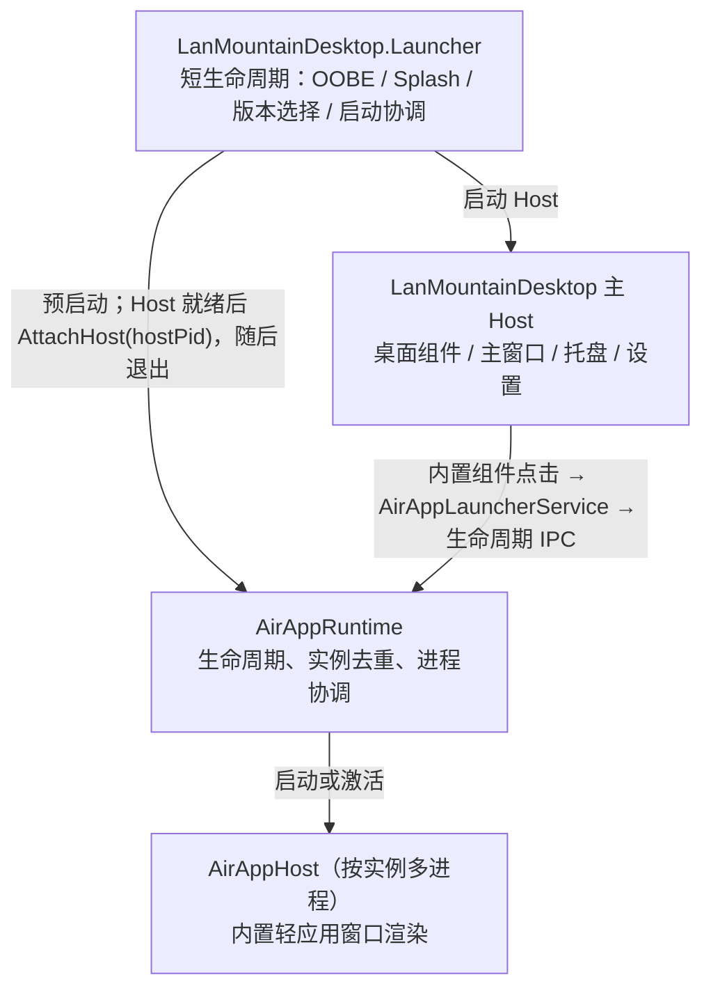

# 整体架构

本文档描述阑山桌面的整体技术架构、各模块职责和交互方式。

## 架构概览

### 核心模块



生产环境中，桌面上的世界时钟、白板和 RSS 阅读器入口属于主 Host 的组件系统。Launcher 不承载这些组件或窗口，也不应在完成 Host PID 交接后继续作为透明/后台窗口存活。

## 项目结构

### 核心项目

| 项目 | 职责 | 类型 |
|------|------|------|
| **LanMountainDesktop** | 桌面宿主主程序 | Avalonia 应用 |
| **LanMountainDesktop.Launcher** | 短生命周期启动协调器（OOBE、Splash、版本管理、Runtime 预启动与 Host 交接） | 独立可执行 |
| **LanMountainDesktop.AirAppRuntime** | Air APP 运行时容器 | 独立服务 |
| **LanMountainDesktop.AirAppHost** | 内置 Air APP 窗口渲染进程 | 框架依赖应用 |

### SDK 和基础设施

| 项目 | 职责 | 类型 |
|------|------|------|
| **LanMountainDesktop.PluginSdk** | 插件 SDK | NuGet 包 |
| **LanMountainDesktop.Shared.Contracts** | 共享契约类型 | 类库 |
| **LanMountainDesktop.Shared.IPC** | IPC 基础设施 | 类库 |

### Air APP 第三方开发原型（尚未接入生产）

| 项目 | 当前状态 |
|------|---------|
| **LanMountainDesktop.AirAppSdk** | API/清单模型原型；生产 Host、Runtime、AirAppHost 与 Launcher 均未引用或加载它 |
| **LanMountainDesktop.AirAppTemplate** | 基于 AirAppSdk 的项目模板原型；其输出不会被生产 Host 自动发现 |
| **LanMountainDesktop.AirAppDevServer** | 构建监视、预览和打包原型；预览宿主仍为 TODO，不属于生产运行路径 |

当前生产 AirAppHost 只按 `appId` 选择编译在程序中的 `world-clock`、`whiteboard`、`rss-reader` 视图，没有第三方 `airapp.json` 扫描、程序集加载或 SDK 生命周期装配。`.laapp` 扩展名当前由插件安装链路使用并要求包内存在 `plugin.json`；AirAppDevServer 以 `airapp.json` 为基础生成的同名扩展包不能作为生产 Air APP 安装包使用。

### 功能模块

| 项目 | 职责 | 类型 |
|------|------|------|
| **LanMountainDesktop.Settings.Core** | 设置系统 | 类库 |
| **LanMountainDesktop.Appearance** | 主题和外观 | 类库 |
| **LanMountainDesktop.DesktopComponents.Runtime** | 组件运行时 | 类库 |
| **LanMountainDesktop.DesktopHost** | 桌面宿主生命周期 | 类库 |

### 未来扩展（计划中）

| 项目 | 职责 | 状态 |
|------|------|------|
| **LanMountainDesktop.PluginIsolation.Contracts** | 插件隔离契约 | 已创建 |
| **LanMountainDesktop.PluginIsolation.Ipc** | 插件隔离 IPC | 已创建 |

## 启动流程

### 生产环境启动

```
1. 用户启动 Launcher.exe
         ↓
2. 首次启动？ → 是 → 显示 OOBE 欢迎页
         ↓ 否
3. 显示 Splash 启动动画
         ↓
4. 扫描 app-* 目录，选择最佳版本
   - 优先选择有 .current 标记的
   - 其次选择版本号最高的
   - 跳过有 .partial 或 .destroy 标记的
         ↓
5. 预启动 AirAppRuntime.exe
   - JIT 框架依赖进程
   - 等待 IPC 管道就绪
         ↓
6. 启动 app-{version}/LanMountainDesktop.exe
         ↓
7. Host 初始化
   - 日志系统
   - 遥测系统
   - 设置加载
   - 主题应用
         ↓
8. 初始化桌面环境
   - 创建桌面窗口
   - 加载插件
   - 注册组件
   - 显示托盘图标
         ↓
9. 启动协调成功，Launcher 获得存活的 Host PID
         ↓
10. Launcher 通过 Runtime 控制 IPC 调用 AttachHost(hostPid)
    - Runtime 确认 Host PID 与进程存活状态
    - 交接失败时记录诊断；Host 仍保留按需启动 Runtime 的兜底
         ↓
11. 写入启动结果并关闭 Splash/Launcher 生命周期
    - 不等待 Host 进程退出
    - 不保留透明或后台 Launcher 窗口
         ↓
12. Host 与 AirAppRuntime 独立运行，桌面就绪
```

### 开发环境启动

```
开发者直接启动 LanMountainDesktop.exe
         ↓
检测到没有通过 Launcher 启动
         ↓
跳过 OOBE 和版本管理
         ↓
正常初始化桌面环境
         ↓
首次点击内置轻应用入口时尝试连接 AirAppRuntime
         ↓
若 Runtime IPC 不可用，由 Host 启动 Runtime 并重试
```

## 内置轻应用运行链路

当前已上线的轻应用链路只覆盖内置世界时钟、白板和 RSS 阅读器：

```
Host 内的桌面组件接收点击
         ↓
AirAppLauncherService 构造 AirAppOpenRequest
         ↓  LanMountainDesktop.AirAppRuntime.v1
IAirAppLifecycleService.OpenAsync(request)
         ↓
AirAppRuntime 解析实例键，激活已有进程或启动 AirAppHost
         ↓
AirAppHost 根据 appId 创建编译内置的窗口内容
```

- 世界时钟共用 `world-clock:clock-suite:global`，RSS 阅读器共用 `rss-reader:global`；白板等其他入口按 `{appId}:{sourceComponentId}:{sourcePlacementId}` 区分实例。
- `sourceComponentId` 与 `sourcePlacementId` 从 Host 组件透传到 AirAppHost，使白板等窗口继续使用对应组件实例的上下文与数据。
- AirAppHost 打开后向 Runtime 注册，关闭时注销；Runtime 负责实例表、激活与回收，不负责渲染窗口。
- 这条链路没有调用 AirAppSdk、AirAppTemplate 或 AirAppDevServer，也不能据此推断第三方 Air APP 已可加载。

## 核心系统

### 1. 组件系统

**职责**: 管理桌面组件的注册、创建、渲染和布局

**架构**:

```
ComponentRegistry (组件注册表)
    ↓ 注册
ComponentDefinition (组件定义)
    ↓ 创建实例
ComponentInstance (组件实例)
    ↓ 渲染
ComponentView (Avalonia UI)
    ↓ 显示
DesktopWidgetWindow (桌面窗口)
```

**关键类**:
- `ComponentRegistry` - 组件注册和查找
- `ComponentBase` - 组件基类
- `ComponentInstanceManager` - 组件实例管理
- `DesktopLayoutService` - 布局管理

### 2. 插件系统

**职责**: 加载、初始化和管理插件生命周期

**运行时模式**:

| 模式 | 状态 | 说明 |
|------|------|------|
| **in-proc** | ✅ 当前默认 | 插件运行在宿主进程内 |
| **isolated-background** | 🚧 规划中 | 后台逻辑隔离进程 |
| **isolated-window** | 🚧 规划中 | UI 渲染隔离进程 |

**加载流程**:

```
1. 扫描插件目录
   %LOCALAPPDATA%\LanMountainDesktop\plugins\
         ↓
2. 读取 plugin.json 清单
         ↓
3. 验证依赖关系
         ↓
4. 创建 PluginLoadContext
         ↓
5. 加载插件程序集
         ↓
6. 创建 IPlugin 实例
         ↓
7. 调用 InitializeAsync()
         ↓
8. 注册组件和服务
```

### 3. 设置系统

**职责**: 管理应用和插件的配置数据

**设置域**:

```
Settings Root
├── General (通用设置)
├── Appearance (外观设置)
├── Components (组件设置)
├── Plugins (插件设置)
│   ├── Plugin A
│   └── Plugin B
└── Advanced (高级设置)
```

**持久化**:
- 位置: `%LOCALAPPDATA%\LanMountainDesktop\settings\`
- 格式: JSON
- 实时保存，延迟写入

### 4. 主题系统

**职责**: 管理亮色/暗色主题、圆角系统

**圆角规范**:

| 级别 | Token | 值 | 用途 |
|------|-------|----|------|
| 基础 | `DesignCornerRadiusBasic` | 4 | 按钮、输入框 |
| 组件 | `DesignCornerRadiusComponent` | 8 | 卡片、面板 |
| 窗口 | `DesignCornerRadiusWindow` | 12 | 窗口、对话框 |

**主题切换**:
1. 用户选择主题
2. `AppearanceService` 切换资源字典
3. 广播主题变更事件
4. 各组件响应并更新 UI
5. 通过 IPC 通知 Air APP

### 5. IPC 系统

**职责**: 进程间通信

**通信拓扑**:

```
启动阶段（Launcher 存活）

┌──────────┐  启动/激活  ┌──────────────┐
│ Launcher │────────────→│ Host         │ ← 外部 IPC 入口点
└─────┬────┘             └──────┬───────┘
      │ Runtime 控制 IPC         │ Air APP 生命周期 IPC
      ↓                         ↓
┌──────────────────────────────────────┐
│ AirAppRuntime                        │
│ GetStatus / AttachHost / Open/Close  │
└──────────────────┬───────────────────┘
                   │ 启动、激活、注册、注销
                   ↓
            ┌─────────────┐
            │ AirAppHost  │（按实例多进程）
            └─────────────┘

稳定阶段（Host attach 完成）

Launcher 已退出；Host ←IPC→ AirAppRuntime ←IPC→ AirAppHost
```

**IPC 管道**:
- `LanMountainDesktop.Host.v1` - 宿主公共服务
- `LanMountainDesktop.AirAppRuntime.v1` - 同一 Runtime 管道上的 Air APP 生命周期服务与 Runtime 控制服务

`IAirAppLifecycleService` 与 `IAirAppRuntimeControlService` 都注册在 `LanMountainDesktop.AirAppRuntime.v1`。`LanMountainDesktop.AirAppRuntimeControl.v1` 不是当前代码中的独立管道名称。

## 数据流

### 设置变更流程

```
用户修改设置
    ↓
SettingsService.SetValue()
    ↓
触发 SettingChanged 事件
    ↓
相关组件监听并响应
    ↓
延迟写入磁盘（防抖 500ms）
```

### 组件更新流程

```
定时器触发 (默认 1 秒)
    ↓
ComponentUpdateService.UpdateAsync()
    ↓
遍历所有组件实例
    ↓
调用 Component.UpdateAsync()
    ↓
组件更新数据
    ↓
UI 自动刷新（数据绑定）
```

### 插件通信流程

```
Plugin A 发送消息
    ↓
PluginMessenger.Send()
    ↓
消息总线分发
    ↓
Plugin B 接收消息
    ↓
处理并可选回复
```

## 安全性

### 权限系统

插件需要声明所需权限：

```json
{
  "Permissions": [
    "FileSystem.Read",      // 读取文件
    "FileSystem.Write",     // 写入文件
    "Network.Access",       // 网络访问
    "System.Info"           // 系统信息
  ]
}
```

### 沙箱隔离（未来）

进程隔离模式下：
- 插件运行在独立进程
- 通过 IPC 访问宿主服务
- 限制文件系统访问
- 限制网络访问

## 性能优化

### 启动优化
- ✅ 延迟加载插件
- ✅ 异步初始化
- ✅ 组件按需创建
- ✅ 资源延迟加载

### 运行时优化
- ✅ 虚拟化列表
- ✅ 图片缓存
- ✅ 布局缓存
- ✅ 事件防抖/节流

### 内存优化
- ✅ 弱事件模式
- ✅ 及时释放资源
- ✅ 图片降采样
- ✅ 组件卸载清理

## 相关文档

- [启动器系统](02-启动器系统.md) - 启动器详细设计
- [插件运行时](04-插件运行时.md) - 插件加载和管理
- [组件系统](05-组件系统.md) - 组件架构和渲染
- [IPC 通信](07-IPC通信.md) - 进程间通信设计
