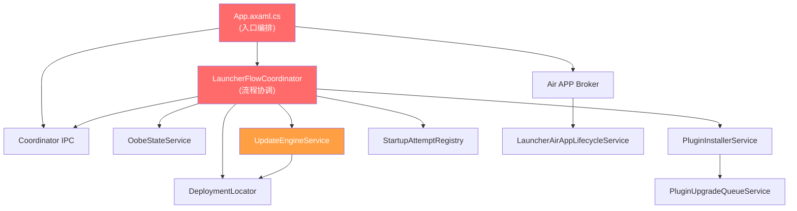

# Launcher 架构拆分评估报告

## 1. 现状分析

### 1.1 Launcher 当前职责清单

根据代码审查，[LanMountainDesktop.Launcher](file:///d:/github/LanMountainDesktop/LanMountainDesktop.Launcher) 当前承担 **6 个主要职责域**：

| 职责域 | 核心文件 | 代码量 | 复杂度 |
|--------|---------|--------|--------|
| **OOBE 首次体验** | `OobeStateService`, `OobeWindow`, `WelcomeOobeStep`, `DataLocationOobeStep`, `PrivacyAgreementService` | ~28 KB | 中 |
| **Splash / 启动协调** | `LauncherFlowCoordinator`, `SplashWindow`, `LoadingDetailsWindow`, `StartupAttemptRegistry` | ~120 KB | **极高** |
| **更新引擎** | `UpdateEngineService`, `UpdateCheckService` | ~77 KB | **极高** |
| **插件管理** | `PluginInstallerService`, `PluginUpgradeQueueService` | ~13 KB | 低 |
| **部署/版本管理** | `DeploymentLocator`, `FlexibleHostLocator`, `DotNetRuntimeProbe`, `LegacyVersionDetector` | ~70 KB | 高 |
| **Air APP 生命周期** | `AirApp/*`, `LauncherBackgroundService` | ~21 KB | 中 |

**总计：~673 KB 源代码，95 个 .cs/.axaml 文件**

### 1.2 关键耦合热点

#### 热点 1：[LauncherFlowCoordinator.cs](file:///d:/github/LanMountainDesktop/LanMountainDesktop.Launcher/Services/LauncherFlowCoordinator.cs) — **90 KB / 2034 行**

这是整个 Launcher 最大的单文件，负责：
- OOBE → Splash → Update → Plugin → Host Launch 的完整编排
- 多实例检测与协调 (IPC coordinator)
- 主程序启动、进程监控、超时处理
- 激活恢复 (activation recovery)
- 所有 UI 窗口的生命周期管理

> [!WARNING]
> 这个文件是当前最大的架构债务。它同时了解所有职责域，是修改任何启动行为都必须触碰的瓶颈文件。

#### 热点 2：[UpdateEngineService.cs](file:///d:/github/LanMountainDesktop/LanMountainDesktop.Launcher/Services/UpdateEngineService.cs) — **72 KB / 1850 行**

包含两套完整的更新应用流程（Legacy 和 PLONDS），内嵌：
- 签名验证
- 增量文件应用
- SHA-256/SHA-512 校验
- 回滚机制
- 快照管理
- 安装检查点与断点续传

#### 热点 3：[App.axaml.cs](file:///d:/github/LanMountainDesktop/LanMountainDesktop.Launcher/App.axaml.cs) — **34 KB / 850 行**

App 入口承担了过多的运行时编排逻辑，包括：
- Coordinator IPC 服务器的创建和管理
- Air APP IPC broker 模式
- 主程序进程存活监控
- 失败恢复 UI 流程

### 1.3 职责域间的依赖关系



> [!IMPORTANT]
> 红色节点是耦合最严重的热点。`LauncherFlowCoordinator` 直接依赖几乎所有其他服务。

---

## 2. 方案评估

### Option A：多项目拆分

将 Launcher 拆分成独立的 .NET 项目/可执行文件：

| 拆分后的项目 | 职责 |
|-------------|------|
| `LanMountainDesktop.Launcher` | 精简入口，仅做 OOBE + Splash + 编排调度 |
| `LanMountainDesktop.UpdateService` | 更新检查、下载、应用、回滚 |
| `LanMountainDesktop.PluginService` | 插件安装、升级队列 |
| `LanMountainDesktop.DeploymentManager` | 版本目录管理、主机发现 |

#### 优点
- 最大化隔离：每个服务可独立部署、独立更新
- 更新引擎可以在 Launcher 自身不运行时被调用（例如计划任务）
- 故障隔离：插件安装崩溃不影响更新流程

#### 缺点

> [!CAUTION]
> **这些缺点在当前阶段是致命的。**

- **进程间通信成本巨大**：当前 `LauncherFlowCoordinator` 的 2034 行编排逻辑严重依赖同进程内的同步/异步调用和共享状态（`TaskCompletionSource`、进程对象引用、UI Dispatcher 调度）。拆成多进程意味着每个交互点都需要 IPC 管道 + 序列化 + 超时处理 + 错误恢复。
- **启动延迟增加**：当前 Launcher 启动到 Host 启动的路径已经很长（OOBE → 更新 → 插件 → 主机发现 → Host 进程启动 → IPC 握手）。多进程会在每个阶段增加进程启动开销。
- **安装包膨胀**：每个独立可执行文件都需要自己的运行时依赖，即使共享 Avalonia SDK。
- **复杂的部署协调**：Launcher 自身不可被拆分更新——它就是更新的入口。如果 `UpdateService` 是独立进程，谁来启动它？又需要一个 meta-launcher。
- **当前代码并未准备好**：`LauncherFlowCoordinator.RunAsync()` 是一个巨大的异步方法，内部有十几个局部变量和闭包在多个 await 之间共享状态。这些状态不可能简单地序列化为 IPC 消息。

#### 改造工程量估算
- **IPC 层**：需新增 ~8-10 个 IPC 契约、每个有请求/响应/通知消息
- **进程管理**：需要为每个子服务编写进程启动、健康检查、重启逻辑
- **状态同步**：`StartupAttemptRegistry` 的锁文件机制需要扩展为跨进程锁
- **估计 3-5 人周**，且引入大量新的故障模式

---

### Option B：单项目内部解耦（推荐）

保持单一 Launcher 可执行文件，通过以下手段实现内部解耦：

#### 阶段 1：职责分层（重构目录结构）

```
LanMountainDesktop.Launcher/
├── Program.cs                          # 入口（保持精简）
├── App.axaml.cs                        # Avalonia 应用（精简到 <200 行）
├── Core/                               # 核心编排层
│   ├── LauncherOrchestrator.cs         # 从 App.axaml.cs 提取的运行时编排
│   ├── StartupPipeline.cs             # 从 FlowCoordinator 提取的阶段管道
│   └── StartupPhase.cs               # 每个阶段的抽象接口
├── Deployment/                         # 版本管理域
│   ├── DeploymentLocator.cs
│   ├── FlexibleHostLocator.cs
│   ├── HostLaunchPlan.cs
│   ├── DotNetRuntimeProbe.cs
│   └── LegacyVersionDetector.cs
├── Update/                             # 更新引擎域
│   ├── UpdateEngineService.cs         # 重构后 <400 行
│   ├── LegacyUpdateApplier.cs         # 从 UpdateEngine 提取
│   ├── PlondsUpdateApplier.cs         # 从 UpdateEngine 提取
│   ├── SignatureVerifier.cs           # 从 UpdateEngine 提取
│   ├── UpdateCheckService.cs
│   └── UpdateSnapshotManager.cs       # 从 UpdateEngine 提取
├── Plugin/                             # 插件管理域
│   ├── PluginInstallerService.cs
│   └── PluginUpgradeQueueService.cs
├── Oobe/                               # OOBE 域
│   ├── OobeStateService.cs
│   ├── IOobeStep.cs
│   ├── WelcomeOobeStep.cs
│   ├── DataLocationOobeStep.cs
│   └── PrivacyAgreementService.cs
├── AirApp/                             # Air APP 域（已部分独立）
│   └── ...
├── Coordination/                       # 多实例协调域
│   ├── StartupAttemptRegistry.cs
│   ├── LauncherCoordinatorIpcServer.cs
│   └── LauncherCoordinatorIpcClient.cs
├── Views/                              # UI 层
│   └── ...
├── ViewModels/                         # ViewModel 层
│   └── ...
└── Models/                             # 数据模型
    └── ...
```

#### 阶段 2：拆分 LauncherFlowCoordinator

将 2034 行的 `RunAsync()` 重构为 Pipeline + Phase 模式：

```csharp
// 启动管道定义（伪代码）
public class StartupPipeline
{
    private readonly IReadOnlyList<IStartupPhase> _phases;

    public async Task<LauncherResult> ExecuteAsync(StartupContext context)
    {
        foreach (var phase in _phases)
        {
            var result = await phase.ExecuteAsync(context);
            if (!result.Continue) return result.LauncherResult;
        }
        return LauncherResult.Success();
    }
}

// 各阶段独立实现
public class CleanupPhase : IStartupPhase { ... }
public class OobePhase : IStartupPhase { ... }
public class UpdatePhase : IStartupPhase { ... }
public class PluginUpgradePhase : IStartupPhase { ... }
public class HostLaunchPhase : IStartupPhase { ... }
public class StartupMonitorPhase : IStartupPhase { ... }
```

#### 阶段 3：拆分 UpdateEngineService

将 1850 行的更新引擎拆分为独立的策略类：

```csharp
// 更新引擎成为协调者，不再包含实现
public class UpdateEngineService
{
    private readonly IUpdateApplier _legacyApplier;
    private readonly IUpdateApplier _plondsApplier;
    private readonly ISignatureVerifier _signatureVerifier;
    private readonly IUpdateSnapshotManager _snapshotManager;
    ...
}
```

#### 阶段 4：精简 App.axaml.cs

将 850 行的 App 入口精简为纯粹的 Avalonia 应用初始化 + 委托给 `LauncherOrchestrator`：

```csharp
public override void OnFrameworkInitializationCompleted()
{
    if (ApplicationLifetime is IClassicDesktopStyleApplicationLifetime desktop)
    {
        var orchestrator = new LauncherOrchestrator(desktop, LauncherRuntimeContext.Current);
        _ = orchestrator.RunAsync();
    }
    base.OnFrameworkInitializationCompleted();
}
```

#### 优点
- **零部署风险**：不改变安装包结构、不引入新进程、不改变 IPC 拓扑
- **增量重构**：可以一个职责域一个域地逐步重构，每次重构都可编译验证
- **测试友好**：拆分后的各 Phase 和 Service 可以独立单元测试
- **保持启动性能**：单进程内的函数调用无 IPC 开销
- **为未来多进程做准备**：如果将来真的需要拆分进程，接口已经清晰

#### 缺点
- 仍然是单进程：更新引擎崩溃会影响 Launcher 进程
- 需要自律维持架构边界（没有编译级隔离）

#### 改造工程量估算
- 阶段 1（目录重组）：~0.5 人天
- 阶段 2（FlowCoordinator 拆分）：~2-3 人天
- 阶段 3（UpdateEngine 拆分）：~1-2 人天
- 阶段 4（App.axaml.cs 精简）：~0.5-1 人天
- **总计 ~4-7 人天**，且风险可控

---

## 3. 决策矩阵

| 维度 | Option A (多项目拆分) | Option B (内部解耦) |
|------|---------------------|-------------------|
| **改造风险** | 🔴 高：引入新 IPC、新故障模式 | 🟢 低：纯重构，行为不变 |
| **改造工期** | 🔴 3-5 人周 | 🟢 4-7 人天 |
| **启动性能** | 🔴 多进程启动开销 | 🟢 零额外开销 |
| **故障隔离** | 🟢 进程级隔离 | 🟡 需靠代码纪律 |
| **独立更新** | 🟢 各服务可独立版本 | 🔴 单一二进制 |
| **可测试性** | 🟢 天然隔离 | 🟢 接口拆分后等效 |
| **安装包大小** | 🔴 膨胀（多 EXE） | 🟢 不变 |
| **部署复杂度** | 🔴 谁更新 Launcher？ | 🟢 VeloPack 现有流程 |
| **团队人力需求** | 🔴 需长期维护多套 IPC | 🟢 维护成本低 |

---

## 4. 推荐方案

> [!IMPORTANT]
> **推荐 Option B：单项目内部解耦**，原因如下：

1. **当前阶段的核心瓶颈不是项目边界，而是文件级别的职责混乱**。`LauncherFlowCoordinator` 一个文件 2034 行，`UpdateEngineService` 一个文件 1850 行，`App.axaml.cs` 一个文件 850 行——这才是真正影响可维护性的问题。

2. **Launcher 的核心约束决定了它必须是单一入口**。根据 [ARCHITECTURE.md](file:///d:/github/LanMountainDesktop/docs/ARCHITECTURE.md) 的定义，Launcher 是 "应用的唯一入口"，负责版本选择、原子化更新和安全启动。这个约束使得多进程拆分的价值大打折扣。

3. **已经存在良好的外部进程隔离**。Host 主程序 (`LanMountainDesktop.exe`)、Air APP Host (`LanMountainDesktop.AirAppHost`) 都是独立进程。Launcher 只需要作为协调者存在，它不需要自己也拆成多个进程。

4. **改造投入产出比**。Option A 需要 3-5 人周且引入新风险，Option B 需要 4-7 人天且零风险，效果（可维护性、可测试性）几乎等效。

---

## 5. Open Questions

1. **是否考虑将 Launcher 的 CLI 模式（`update check`、`update apply`、`plugin install`）独立成一个无 UI 的命令行工具？** 这是一个比全面拆分轻量得多的拆分点，可以让 CI/CD 和脚本调用不依赖 Avalonia 运行时。

2. **`UpdateEngineService` 是否打算支持 Launcher 自身的自更新？** 如果是，可能需要一个极简的 "bootstrap updater" 组件，这是唯一可能需要独立进程的场景。

3. **内部解耦后，是否要引入 `Microsoft.Extensions.DependencyInjection`？** 当前所有服务都是手动 `new` 的，引入 DI 容器可以自然地约束依赖方向，但也会增加 Launcher 启动路径的复杂度。

